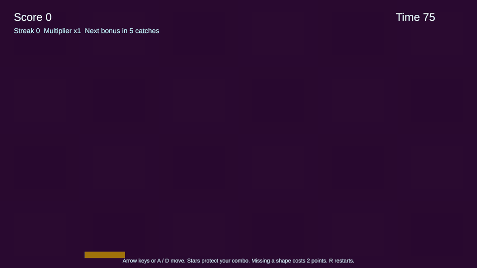
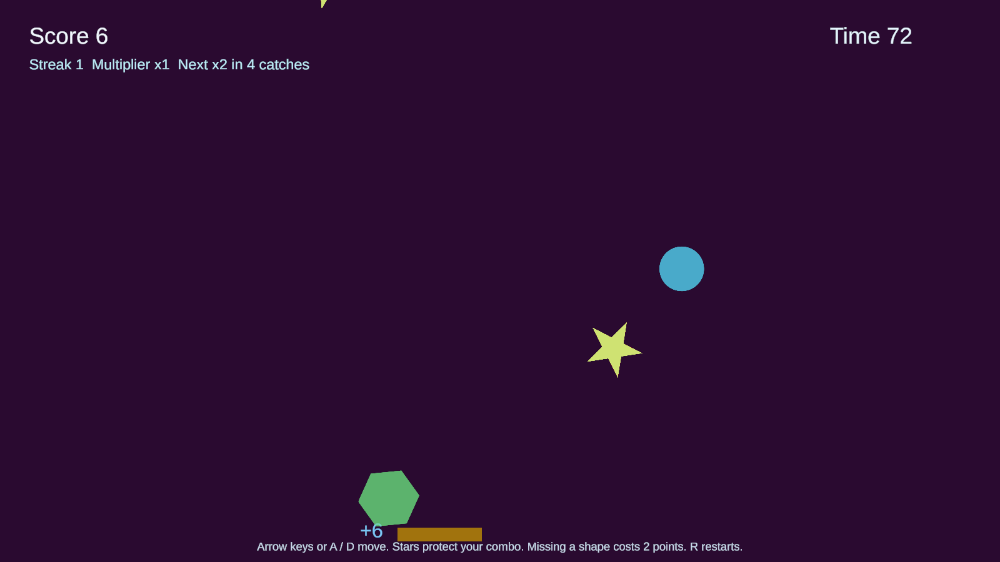
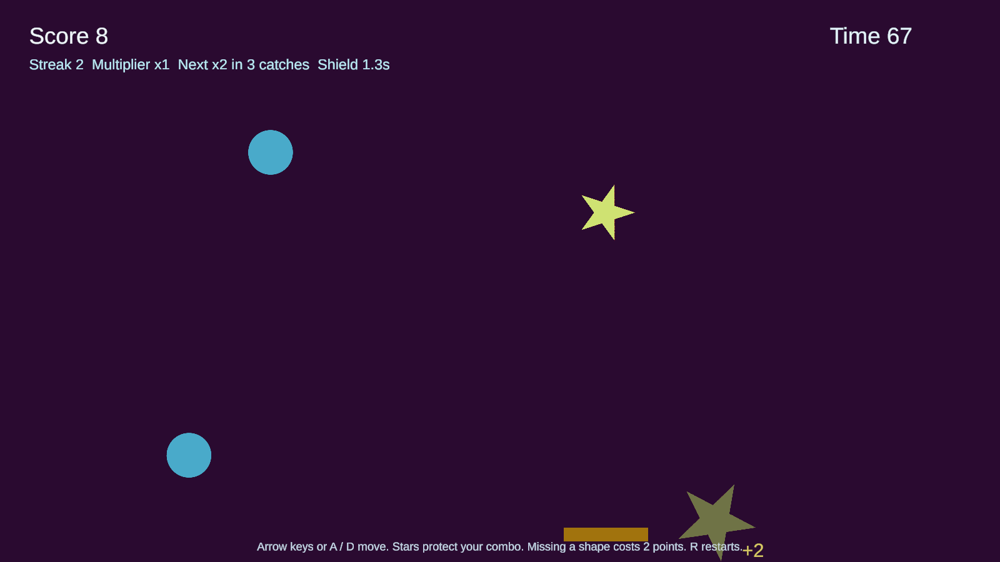
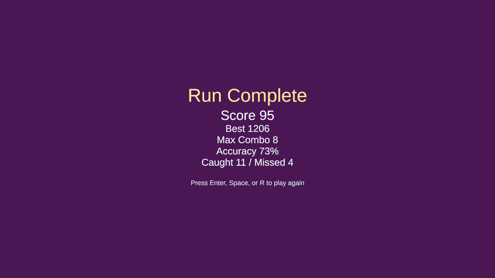
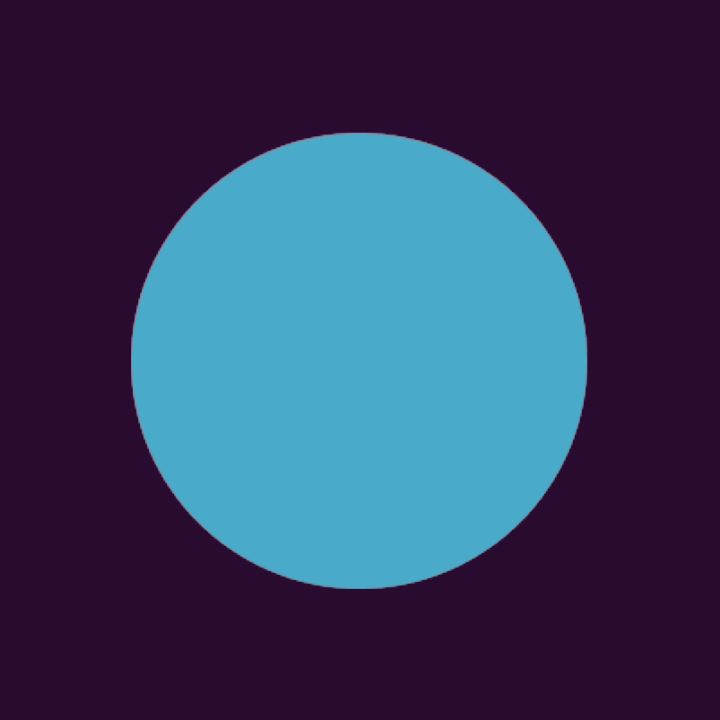
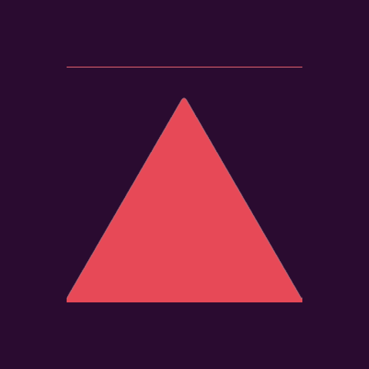
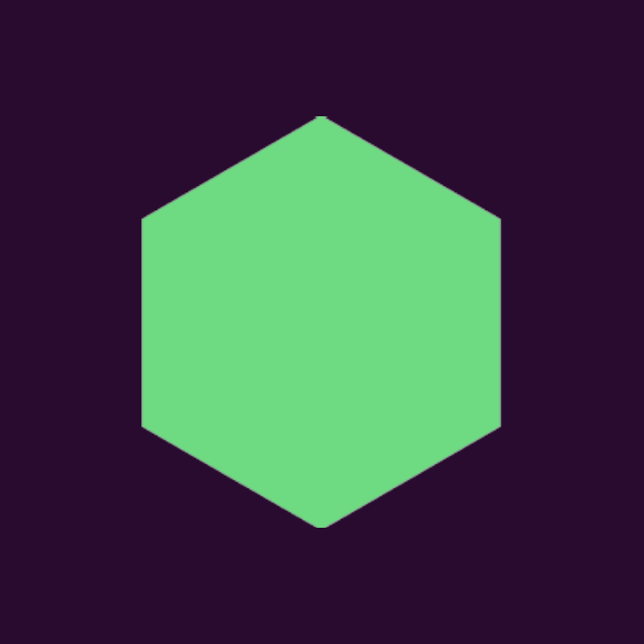
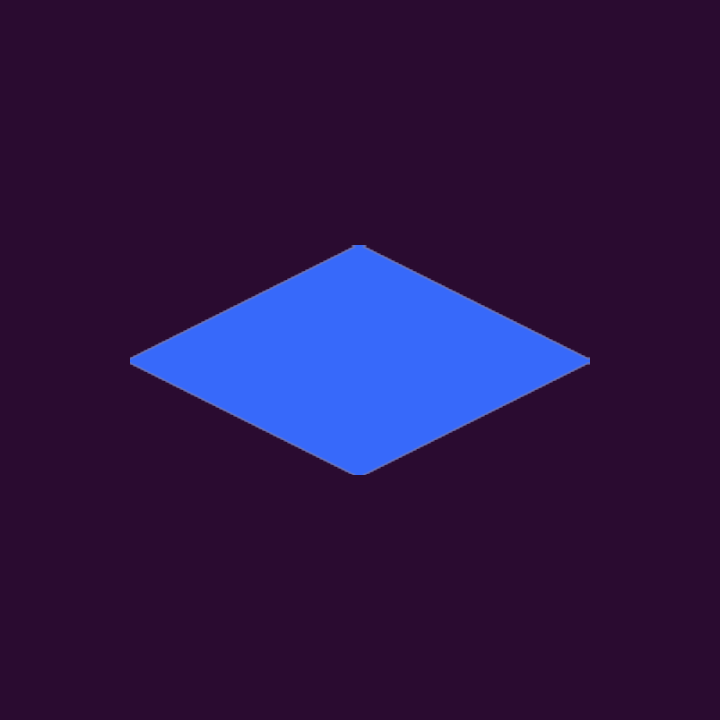
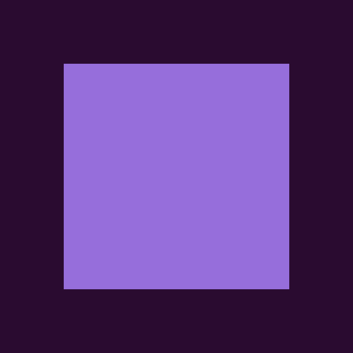

# Falling Shapes Game

Arcade game built with Unity 2022.3 and C#. You control a paddle, catch falling shapes, build a streak-based multiplier, and survive a full 75-second run while the pace ramps up.

## Demo

  

## Overview

Gameplay focuses on:

- Paddle movement and deterministic falling-shape motion
- Streaks and score multipliers that reward consistency
- Distinct targets with different point values and movement patterns
- Short, replayable runs with increasing intensity over time
- HUD and result screens that communicate score, combo, and accuracy

## Screenshots

|  |  |
|:----------------------------------------------------------------------------------:|:-----------------------------------------------------------------------------------------------------:|
| **Main Gameplay** | **Combo and Multiplier** |

  

## Scoring and Shape Guide

Scoring rules:

- Each caught shape awards its base point value multiplied by your current multiplier.
- Your streak is the number of consecutive catches since the last unshielded miss.
- Streak 0-4: multiplier x1.
- Streak 5-8: multiplier x2.
- Streak 9-12: multiplier x3.
- Streak 13+: multiplier x4.
- Missing a shape subtracts 2 points and resets your streak unless a star shield is active.
- Catching a star gives you a one-miss combo shield for 1.75 seconds.

<table>
  <tr>
    <td width="140" align="center">
      
    </td>
    <td>
      <strong>Circle</strong> 
      <strong>1 base point.</strong> The most reliable combo builder. Circles spawn often, fall relatively slowly, and use only light sway, so they are the safest targets for stabilizing a streak.
    </td>
  </tr>
  <tr>
    <td width="140" align="center">
      
    </td>
    <td>
      <strong>Star</strong> 
      <strong>2 base points.</strong> Stars are common support targets. Catching one activates a short shield that protects the combo from the next miss, which makes them valuable when the screen gets crowded late in the run.
    </td>
  </tr>
  <tr>
    <td width="140" align="center">
      
    </td>
    <td>
      <strong>Triangle</strong> 
      <strong>4 base points.</strong> Triangles drop fast with very little horizontal drift, so they reward quick reads and direct paddle movement more than wide repositioning.
    </td>
  </tr>
  <tr>
    <td width="140" align="center">
      
    </td>
    <td>
      <strong>Hexagon</strong> 
      <strong>6 base points.</strong> Hexagons are defined by large side-to-side sway. They are less common than circles and stars, and they force you to track lateral movement instead of just raw fall speed.
    </td>
  </tr>
  <tr>
    <td width="140" align="center">
      
    </td>
    <td>
      <strong>Diamond</strong> 
      <strong>12 base points.</strong> Diamonds telegraph briefly before accelerating into a high-value drop. They are designed as burst-reward targets that test timing rather than pure reaction speed.
    </td>
  </tr>
  <tr>
    <td width="140" align="center">
      
    </td>
    <td>
      <strong>Square</strong> 
      <strong>24 base points.</strong> Squares are the highest-value targets in the game. They fall the fastest, arrive less often, and are intended to create high-risk decision moments during intense streaks.
    </td>
  </tr>
</table>

## Controls

- `Left Arrow` / `Right Arrow` move the paddle
- `A` / `D` also move the paddle
- `R` restarts the run

## Tech Stack

- Unity `2022.3.47f1`
- C#
- Unity 2D tools and physics
- TextMeshPro for HUD and results UI

## Local Setup

1. Clone or download this repository.
2. Open Unity Hub.
3. Add this folder as a project and open it with Unity `2022.3.47f1`.
4. Open `Assets/Scenes/MainScene.unity`.
5. Press Play in the Unity editor.

## Credits

- Ticking sound: https://pixabay.com/sound-effects/search/ticking/
- Lose point sound: https://pixabay.com/sound-effects/search/error%20point/
- Circle sound: https://pixabay.com/sound-effects/search/game%20point/
- Triangle sound: https://pixabay.com/sound-effects/classic-game-action-positive-30-224562/
- Diamond sound: https://pixabay.com/sound-effects/search/magic/
- Hexagon sound: https://pixabay.com/sound-effects/classic-game-action-positive-1-224407/
- Square sound: https://pixabay.com/sound-effects/search/increase%20point/
- Star sound: https://pixabay.com/sound-effects/classic-game-action-positive-4-224403/
- Star sprite: https://clipart-library.com/free/white-star-png-transparent.html
